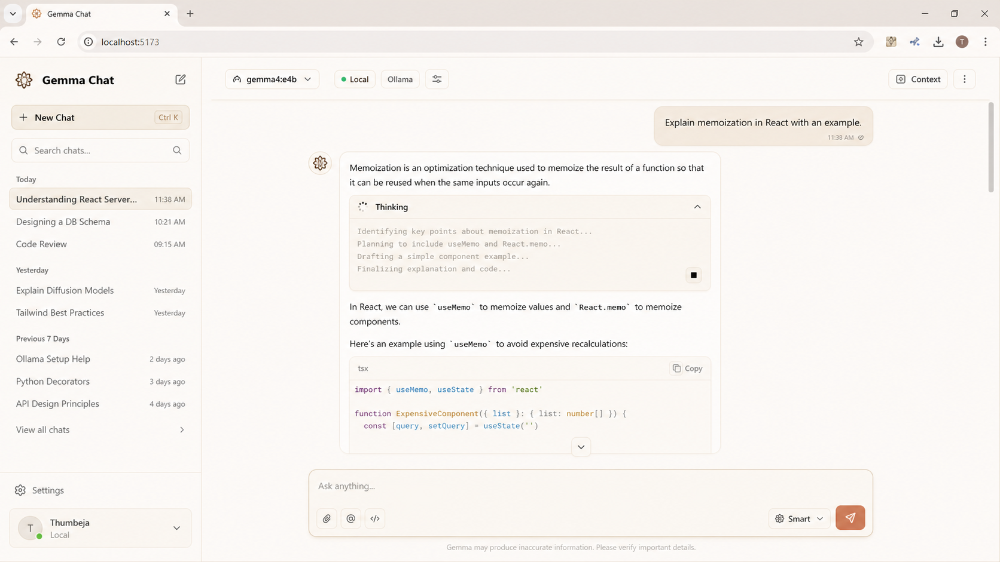

# Gemma Chat

A calm, local-first chatbot UI for `gemma4:e4b` running on Ollama.

Gemma Chat is a React + TypeScript app that talks to your local Ollama server, streams replies live, renders markdown cleanly, and shows a collapsible thinking panel only when the model actually returns thinking tokens.



## Features

- Local Ollama chat using `gemma4:e4b`
- Streaming responses through Ollama's `/api/chat`
- Optional thinking mode with a collapsible reasoning panel
- Image input for vision-capable Ollama models
- PDF and text/code file attachments with client-side text extraction
- Markdown, tables, lists, and code blocks via `react-markdown` and `remark-gfm`
- Warm beige, Claude-inspired interface
- Recent chat history saved in browser local storage
- Runtime controls for thinking, temperature, and context window
- Vite proxy so the browser does not call Ollama directly

## Stack

- React 19
- TypeScript
- Vite 8
- Tailwind CSS 4
- Lucide React icons
- `react-markdown`
- `remark-gfm`
- `pdfjs-dist`
- Dexie / IndexedDB
- Ollama

## Requirements

- Node.js
- npm
- Ollama
- The `gemma4:e4b` model pulled locally

Pull the model:

```powershell
ollama pull gemma4:e4b
```

Start Ollama if it is not already running:

```powershell
ollama serve
```

## Run Locally

Install dependencies:

```powershell
npm install
```

Start the Vite dev server:

```powershell
npm run dev
```

Open:

```text
http://127.0.0.1:5173
```

## Build

```powershell
npm run build
```

## How It Works

The app sends chat requests to a local Vite proxy:

```text
Browser -> Vite /ollama proxy -> http://127.0.0.1:11434/api/chat
```

The proxy is configured in `vite.config.ts`.

Image attachments are sent to Ollama as base64 `images` on the user message. PDF and text files are extracted in the browser and appended as text context because Ollama chat does not take PDFs as native file objects.

Chat history is stored locally in IndexedDB through Dexie. No backend or cloud database is required.

The default model is configured in:

```text
src/lib/constants.ts
```

```ts
export const MODEL_NAME = 'gemma4:e4b'
```

## Project Structure

```text
src/
  components/     UI components
  hooks/          Chat state and streaming logic
  lib/            Constants, formatting, Ollama API helpers
  types/          Shared TypeScript types
  App.tsx         App layout
  index.css       Full app styling
```

## Privacy

Gemma Chat is designed for local use. The app talks to Ollama on your own machine through `127.0.0.1`. Chat history is stored in browser local storage. It is not sent to any cloud service by this app.

## Notes

Thinking is not faked in the UI. The thinking accordion appears only when Ollama streams `message.thinking`. Normal answer text renders from `message.content`.
